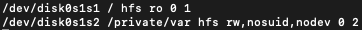
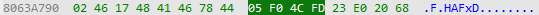
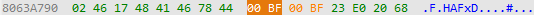
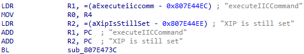
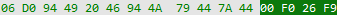
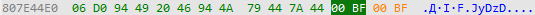

<link rel="stylesheet" type="text/css" href="styles.css">

# iOS 6 iPhone 5C downgrade guide
This guide will show you how to install iOS 6 on your iPhone 5C, please note that it is very broken, touch does **not** work, and the device will kernel panic a few seconds after booting. 

## Disclaimer
I am **not** responsible for any damage to your devices caused by following this guide. Please proceed with caution and at your own risk. 

## Credits
- [NyanSatan](https://x.com/nyan_satan) for the 32-Bit iOS Dualboot guide and fixkeybag
- [throwaway](https://x.com/throwaway167074) for telling me how they booted iOS 6 on the iPhone 5C
- [libimobiledevice](https://github.com/libimobiledevice) for irecovery
- [LukeZGD](https://github.com/LukeZGD) for Legacy iOS Kit
- [dora2ios](https://x.com/dora2ios) for ipwnder_lite
- [danzatt](https://github.com/danzatt) for reimagine
- [Darwin on ARM Project](https://github.com/darwin-on-arm) for image3maker
- [iH8sn0w](https://x.com/ih8sn0w) for iBoot32Patcher
- [OothecaPickle](https://github.com/OothecaPickle) for xpwn (*Note: This is a fork of multiple forks, go to the repository to see who made the original and other forks*)

## Note
When I use angle brackets (`< >`), they indicate placeholders. Do not include the brackets themselves in your input. For instance, `<enter>` means press the Enter key, and `<default value - 4>` means you should input the default value minus 4. 

## Requirements
- **A macOS system**, you might be able to do this on Linux but I highly recommend using macOS 
- [IDA Pro](https://hex-rays.com/ida-pro) for patching the kernelcache 
- **An iPhone 5 6.x iPSW, and an iPhone 5C 7.0 iPSW**, you can get these from [The Apple Wiki](https://theapplewiki.com/wiki/Firmware) 
- [gnu-tar](https://formulae.brew.sh/formula/gnu-tar) to compress the RootFS 
- [fixkeybag](https://raw.githubusercontent.com/Kaiden-AC/iOS6-5C/main/fixkeybag) for generating the system keybag
- [irecovery](https://formulae.brew.sh/formula/libirecovery) to send bootchain components 
- [Legacy iOS Kit](https://github.com/LukeZGD/Legacy-iOS-Kit) for the SSH ramdisk to install the iOS 6 RootFS on to the device 
- [ipwnder_lite](https://github.com/dora2ios/ipwnder_lite) to put the device in pwndfu mode
- [reimagine](https://github.com/Kaiden-AC/reimagine/releases/tag/v0.0.1) to decrypt firmware components 
- [image3maker](https://github.com/darwin-on-arm/image3maker) to repack img3 images
- [iBoot32Patcher](https://github.com/iH8sn0w/iBoot32Patcher) to patch iBoot components 
- [xpwn](https://github.com/OothecaPickle/xpwn) for **xpwntool** and **dmg**, we will use **xpwntool** to decompress and recompress the kernelcache, and **dmg** to decrypt the RootFS 

## Preparations
First decrypt the RootFS DMG, you can get firmware keys and file names from [The Apple Wiki](https://theapplewiki.com/wiki/Firmware) 
`dmg extract encrypted.dmg extract.dmg -k <key>` 

Then convert it to UDZO format 
`dmg build extract.dmg udzo.dmg` 

Mount the DMG, take note of the mount point 
`hdiutil attach udzo.dmg` 

Enable ownership on the volume 
`sudo hdiutil enableOwnership <mountpoint>` 

Create a tar from the volume 
`sudo gtar -cvf fw.tar -C <mountpoint> .` 

## Partitioning
First, we need to boot the SSH ramdisk, enter DFU mode on your device and run Legacy iOS Kit 
`./restore.sh` 

Then navigate to **Other Utilities > SSH Ramdisk** and enter **11A470a** for the build number, follow the steps to boot the ramdisk, then select `Connect to SSH` 

Now once we are in the ramdisk, we need to partition the disk 
`gptfdisk /dev/rdisk0s1` 

Delete the existing partitions 
`d <enter> 1 <enter> d <enter>` 

Now create the new partitions 
`n <enter> 1 <enter> <enter> 524294 <enter> <enter>` 
`n <enter> <enter> <default value - 4> <enter> <enter>` 

Rename the new partitions 
`c <enter> 1 <enter> System <enter>` 
`c <enter> 2 <enter> Data <enter>` 

Write the new partition table 
`w <enter> Y <enter>` 

Now we need to create filesystems 
`/sbin/newfs_hfs -s -v System -J -b 4096 -n a=4096,c=4096,e=4096 /dev/disk0s1s1` 
`/sbin/newfs_hfs -s -v Data -J -P -b 4096 -n a=4096,c=4096,e=4096 /dev/disk0s1s2` 

## Extracting RootFS
Mount the System partition 
`mount_hfs /dev/disk0s1s1 /mnt1` 

Extract the RootFS tar over SSH 
`cat fw.tar | ssh -p 6414 root@localhost "cd /mnt1; tar xvf -"` 
*Note: If you get an error, you may have to add -oHostKeyAlgorithms=+ssh-dss after the port number* 

After that completes, we need to move files to the Data partition, first mount the Data partition 
`mount_hfs /dev/disk0s1s2 /mnt2` 

Now move files from /private/var 
`mv -v /mnt1/private/var/* /mnt2` 

We need to edit fstab to use the new partitions, on macOS run 
`scp -P 6414 root@localhost:/mnt1/private/etc/fstab ./fstab` 
*Note: If you get an error, you may have to add -oHostKeyAlgorithms=+ssh-dss after the port number* 

Open it in nano, in macOS run 
`nano fstab` 

And edit it to look like this 

 

Send it back to the device, in macOS run 
`scp -P 6414 ./fstab root@localhost:/mnt1/private/etc` 
*Note: If you get an error, you may have to add -oHostKeyAlgorithms=+ssh-dss after the port number* 

Now we need to install fixkeybag, in macOS run 
`scp -P 6414 ./fixkeybag root@localhost:/mnt1` 
*Note: If you get an error, you may have to add -oHostKeyAlgorithms=+ssh-dss after the port number* 

Now create launchd.conf and set executable permissions, in macOS run 
`nano launchd.conf` 

And enter the following contents 
`bsexec .. /fixkeybag` 

Send it to your device, in macOS run 
`scp -P 6414 ./launchd.conf root@localhost:/mnt1/private/etc` 
*Note: If you get an error, you may have to add -oHostKeyAlgorithms=+ssh-dss after the port number* 

Now back on the device, set UNIX permissions to 755 
`chmod 755 /mnt1/fixkeybag` 

Unmount both partitions and reboot the device 
`umount /mnt1 /mnt2` 
`reboot_bak` 

## Patching boot components
First decrypt iBSS and iBEC from your iPhone 5C 7.0 iPSW 
`reimagine iBSS.boardconfig.RELEASE.dfu iBSS.raw -iv <iv> -k <key> -r` 
`reimagine iBEC.boardconfig.RELEASE.dfu iBEC.raw -iv <iv> -k <key> -r` 

Patch the iBSS and iBEC 
`iBoot32Patcher iBSS.raw iBSS.patched` 
`iBoot32Patcher iBEC.raw iBEC.patched -b "-v amfi=0xff cs_enforcement_disable=1"` 

Pack the iBSS and iBEC into an img3 container 
`image3maker -f iBSS.patched -t ibss -o iBSS.img3` 
`image3maker -f iBEC.patched -t ibec -o iBEC.img3` 

Decrypt the DeviceTree from your iPhone 5 6.x iPSW 
`reimagine DeviceTree.boardconfig.img3 devicetree.img3 -iv <iv> -k <key>` 

Decrypt the kernelcache from your iPhone 5 6.x iPSW 
`reimagine kernelcache.release.boardconfig kernelcache.dec -iv <iv> -k <key>` 

Decompress the kernelcache from your iPhone 5 6.x iPSW 
`xpwntool kernelcache.release.boardconfig kernelcache.raw -iv <iv> -k <key>` 

Open your decompressed kernelcache in IDA Pro, make sure your settings are the same as below when opening it 

 

Once the file is open, navigate to **Edit > Select all** in the toolbar, then press **C**, then click **Analyze** 
*Note: If it asks "Undefine already existing code/data?" click Yes* 

Once the kernelcache is fully analyzed, navigate to **Search > Text...** 
Now search for "could not find system ID" 

Once the search is finished, you should see something like this 

 

Place your cursor just before `BL` and switch to hex view 

 

Press **F2** and type `00BF00BF`, this should replace the highlighted 4 bytes with 00BF00BF 

 

Now switch back to IDA view and navigate to **Search > Text...** again, this time searching for "XIP is still set" 

Once the search has finished, you should see something like this 

 

Place your cursor just before `BL` and switch to hex view 

 

Press **F2** and type `00BF00BF`, this should replace the highlighted 4 bytes with 00BF00BF 

 

Now switch back to IDA view and navigate to **Edit > Patch program > Apply patches to input file...** 
Leave default settings and press **OK** 

Now recompress the kernelcache 
`xpwntool kernelcache.raw kernelcache.img3 -t kernelcache.dec` 

## Booting the device

Send iBSS 
`irecovery -f iBSS.img3` 

Send iBEC 
`irecovery -f iBEC.img3` 

Send DeviceTree 
`irecovery -f devicetree.img3` 

Execute DeviceTree 
`irecovery -c devicetree` 

Send kernelcache 
`irecovery -f kernelcache.img3` 

Boot the device 
`irecovery -c bootx` 

**Done!**